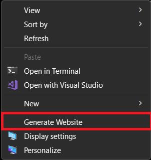

# ContextualDAT
Adds a `Generate Website` shortcut to the Windows background context menu.



Note that this shortcut will not appear when right clicking on files or folders.  The click must be on the background area.  Clicking the shortcut will create the following subdirectory structure in the folder where the context menu was activated:

```
{Root}
 └── website #
      ├── model-a
      │    ├── index.html
      │    ├── script.js
      │    └── styles.css
      └── model-b
           ├── index.html
           ├── script.js
           └── styles.css
```
All files created are empty to allow for easy copy/pasting.

### Installation
This is manual for the moment but, luckily, isn't too involved.  I'll build an installer if this sees any real usage.

1) Download the .zip file in the [Latest Release](https://github.com/ChuckTerry/ContextualDAT/releases/latest).
2) Extract the contents to a new folder.
3) Move `ContextualDAT.exe` to the root of your C: Drive.
    - You may get an access-denied dialog stating that you need to provide administrator permission.  If so, click `Continue`.
4) Back up your registry (**Always** air on the side of caution when modifying the registry).
5) Double-click the file `ContextualDAT.reg`.
    - A warning should appear that says "Adding information can unintentionally change or delete values and cause components to stop working correctly. [...] Are your sure you want to continue?"; Click `Yes`.
    - A confirmation dialog will appear stating that the keys and values have been added to the registry;  Click `OK`.
6) Delete the folder created in step 2.
9) Congrats, you've successfully installed ContextualDAT!  The context menu entries should appear and be functional immediately with needing to restart.

### Uninstallation
1) Download the .zip file in the [Latest Release](https://github.com/ChuckTerry/ContextualDAT/releases/latest).
2) Extract the contents to a new folder.
3) Right-click the file `ContextualDAT.reg` and open it with a text editor (Notepad, Notepad++, etc.).
4) On every line that begins with `[`, change it to begin with `[-`.  For example if it starts with `[HKEY_LOCAL_MACHINE...` change it to `[-HKEY_LOCAL_MACHINE...`.
5) Save the file, then double-click it to run the registry modification.
    - A warning may appear that says "Removing information can unintentionally change or delete values and cause components to stop working correctly. [...] Are your sure you want to continue?"; Click `Yes`.
    - A confirmation dialog will appear stating that the keys and values have been removed to the registry;  Click `OK`.
6) Delete the folder created in step 2.
7) Open Windows Explorer and navigate to your C: Drive
8) Delete `ContextualDAT.exe` and follow through any dialog boxes that appear.v
